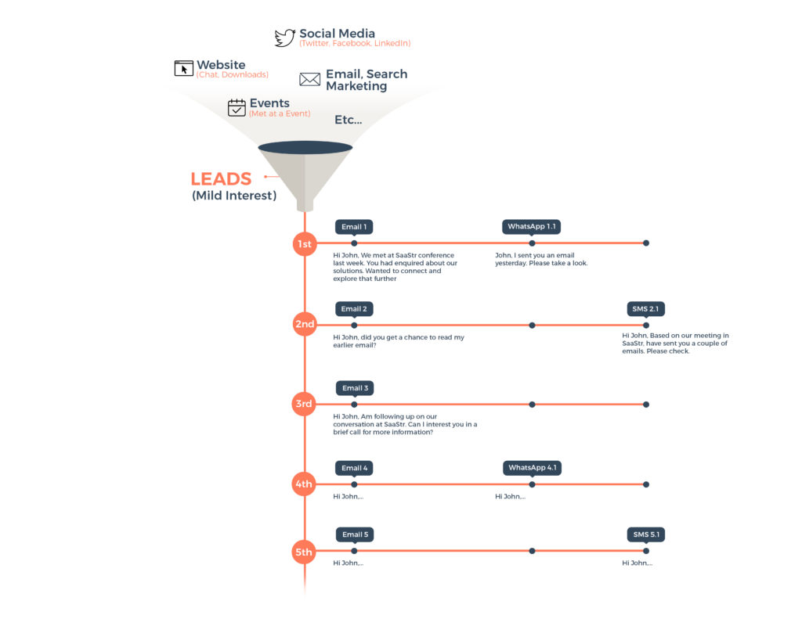
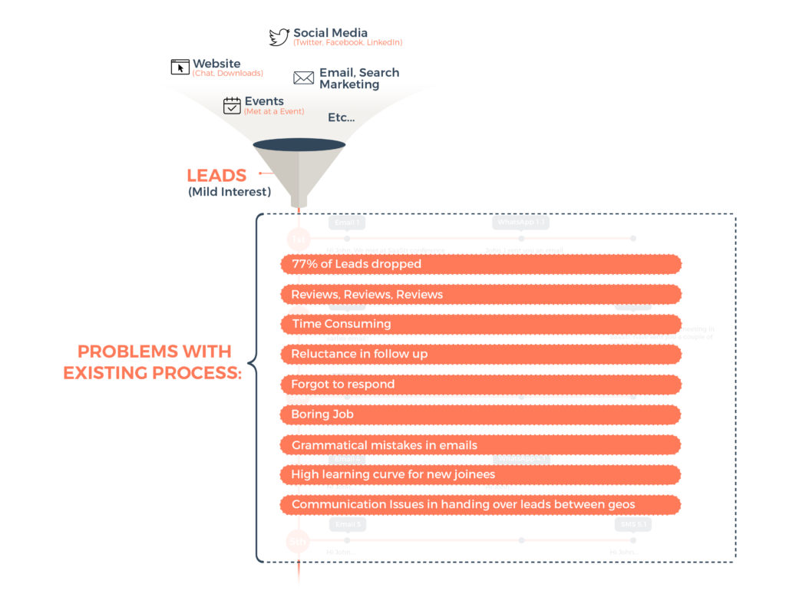
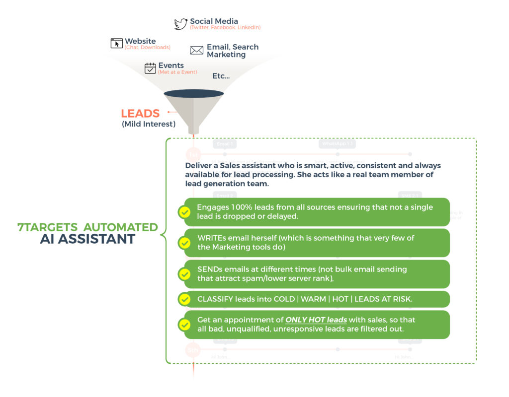

## Video on  Nurturing and converting leads like never before

    <iframe src="https://www.youtube.com/embed/9TxHUtX6LJg" height="380" width="560" 
    allow="autoplay; encrypted-media"
    frameborder="0">
    </iframe>

Hopefully, you have had an extremely successful event and you got a lot of leads from those events. You also have a bunch of visiting cards. And now, to process these hundreds of leads, you may have already sent an initial thank you email thanking everybody who joined you at your booth. Hard work is not over yet. It’s essential to make sure that you continue to follow up EACH and EVERY new lead. Below is an example of a good process.  

No lead should slip through the cracks. This is important. Dropped Leads can mean dropped revenue. We need to be extremely diligent about lead followups. And do SEVERAL lead followups. The above approach, although a good process, has several problems.  

These problems of grammatical errors, time lost due to reviews, delayed responses, motivating people to follow up each lead so many times are not easy to overcome.

To solve these problem, we have developed a AI sales assistant.

7Targets AI Assistant processes 100% of the leads and she doubles your chances of getting meetings. She does the followup related heavy lifting. As a sales or a marketing person, all you need to do is select your sales assistant, give her a name, a number, a good title like a ‘Business Development Assistant’! Voila, you are done with the setup. All you need to do now is add leads. The BEST part of this solution

- You do NOT have to TYPE the emails!
- You DO NOT have to specify how to follow up.
- You do NOT have to specify how many times to follow up.
All this is done by your Sales Assistant. She will
- pick up all your leads,
- CLASSIFY them and
- Only the HOT leads are sent to Sales for closing.

Moreover, The AI Assistant is trained for reading ‘out of office’ response. She sets the follow up dates accordingly. Secondly, if the lead is busy and would like to be contacted later on, she respects that and contacts the lead later. She NEVER DROPS A LEAD.

To know the story behind starting 7Targets you can read [Why is it important to help more smaller companies succeed? 7Targets story](https://blog.7targets.ai/why-important-help-smaller-companies-succeed-sanju-burkule-rashmi-mishra-story/).

**Must Read:** [ Dropped Leads = Lost Revenue](https://blog.7targets.ai/lead-generation-dropped-leads-is-lost-revenue/)

Best way to learn more is to try our assistant. It takes a few minutes to get setup and running. Please contact info@7Targets.com for more information.

(Please note: We address our AI Assistant as a ‘she’ because Alexa and Siri and other well known assistants are female names, but 7Targets AI Assistant allows you to name your own assistant.)

