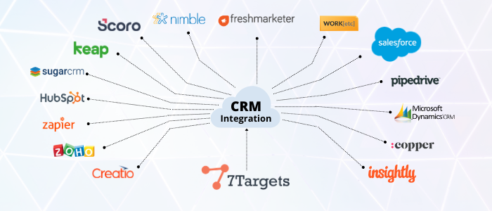

## Video on How 7Target's AI Assistant owns and nurtures the lead from Salesforce 

    <iframe src="https://www.youtube.com/embed/OJUD5ufvHkQ" height="380" width="560" 
    allow="autoplay; encrypted-media"
    frameborder="0">
    </iframe>

We all know that Salesforce is one of the best CRM tools available, but when it comes to all the mundane and repetitive tasks of data entry, it’s not easy. Updating data into salesforce requires discipline more than time and it shifts the focus from pipeline generation work to administrative work. Also, there are possibilities of human errors, shortcuts, people updating Salesforce just for namesake so that the ‘modified date’ is updated and the record does not become stale.

The AI assistant of 7Targets not only sends automated human-like emails to the leads, but also reads the email responses, and acts just like any human being would. She follows up with each lead until they can be marked as warm or hot. 

And to top it all, the AI assistant is also capable of updating all the information into the salesforce CRM instantly and accurately.

Not only just Salesforce but also updates every other CRM tools available. To name a few Hubspot, SugarCRM, Zoho, Freshmarketer, Pipedrive, etc.

## How it works
AI assistant is setup as one more user in salesforce. You just have to go into salesforce, select the leads that you want the assistant to work on for a particular campaign, and change the owner to the AI assistant.

Once assigned, the assistant will start the communication using the proper context and source. The Assistant will own the lead communications and will update the activity notes status in salesforce for every communication sent to the lead. After the initial conversation, if the lead responds positively, the lead is immediately marked as a HOT lead in salesforce, the AI assistant will update the response email in salesforce, automatically change the owner back from you so that you get an email notification from salesforce that the lead is HOT.

Watch how does AI Sales Assistant remind sales executives and ENSURES that they do not forget to respond. 

    <iframe src="https://www.youtube.com/embed/bkjCyfOkfgc" height="380" width="560" 
    allow="autoplay; encrypted-media"
    frameborder="0">
    </iframe>

## Outcome
This feature reduces the efforts required to enter the data into salesforce considerably. Salesforce remains updated. Reports look correct. Management is happy. The Pipeline remains good. Conversions remain the focus because sales guys get to focus on responded leads and not cold leads. 90% of cold leads are worked upon by the assistant, which directly reduces 90% of effort for each salesperson. 

If you are still confused about if you should employ an AI sales assistant or a human, you can watch a short video on Comparison between Virtual Sales Assistant and AI Sales Assistant here.

    <iframe src="https://www.youtube.com/embed/jlJON5LTUas" height="380" width="560" 
    allow="autoplay; encrypted-media"
    frameborder="0">
    </iframe>

Feel free to [sign-up](https://7targets.ai/sign-up.html?utm_medium=AI-assist-as-SF-user&utm_source=7tsblogs) for free trial and give it a try and experience how an AI assistant can reduce your effort.