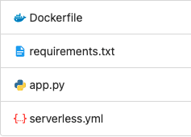

When you are using a python library that's very big in size, you cannot use plain code to deploy, because there is a limit of 256MB as of writing this. Many python libraries like pandas, numpy, etc are so big in size that together along with the code they go above the limit. This is where the use of deploying lambda container comes in.

# What we are going to do?

Create a simple python based [AWS Lambda](https://aws.amazon.com/lambda/) Container and deploy it on AWS using [Serverless Framework](https://www.serverless.com/).

# Lets get started...!

There are 3 steps involved in deploying AWS container:

- Writing Lambda Code or the Lambda function in Python
- Creating a `Dockerfile`
- Creating `serverless.yml` file and deploying the function

## Writing Lambda Code

For tutorial purpose lets write a simple python file and name it as `app.py`

```python
def handler(event, context):
		print("Hello From Inside the Lambda Function")
		return event
```

## Creating Dockerfile

Lets create a `Dockerfile` in the same directory.

```docker
# Pull base lambda python3.8 docker image
FROM public.ecr.aws/lambda/python:3.8

# Copy python requirements file
COPY requirements.txt .

# Install the python packages
RUN pip install -r requirements.txt

# Copy function code
COPY app.py ${LAMBDA_TASK_ROOT}

# Set the CMD to your handler (could also be done as a parameter override outside of the Dockerfile)
CMD [ "app.handler" ]
```

### Explaination

1. Use Python based Lambda Docker Image from Docker Hub as base image
2. Copy requirements.txt if there are some external packages that needs to be installed. (Optional)
3. Install the requirements using `pip`. (Optional)
4. Copy Lamdba code we wrote above in the lambda directory.
5. Set the command to run the function.

## Create Serverless file

We will create a `serverless.yml` file in the same directory which will have some lambda configurations.

```yaml
service: test-app
frameworkVersion: '2'

provider:
  name: aws
  stage: dev
  region: us-east-1
  ecr:
    images:
      latest:
        path: ./

functions:
  print-hello:
    image:
      name: latest
```

## Final directory Structure



## Deploying the code

In the terminal, go to the above code directory and enter below command.

```powershell
sls deploy
```

This will first create the docker image and push that image on **[AWS ECR](https://aws.amazon.com/ecr/)**. Then it will deploy the lambda function specifying it to use the above created docker image.

# How did we use the model?

We had to run real time inference of the data on AWS Lambda and for that we used `[pytorch](https://pytorch.org/)` library which is around 700MB in size. So we had to come up with this approach of deploying the Lambda Container.

# Summing up!

In this article, I have demonstrated the simplest workflow required to deploy python based Lambda Container on AWS. You can also use your own base image to run AWS Lambda Container. You can find that tutorial here.

Hit me up on my [email](mailto:hello@tanmaysinghal.dev) if you have any questions.

Thanks for reading!